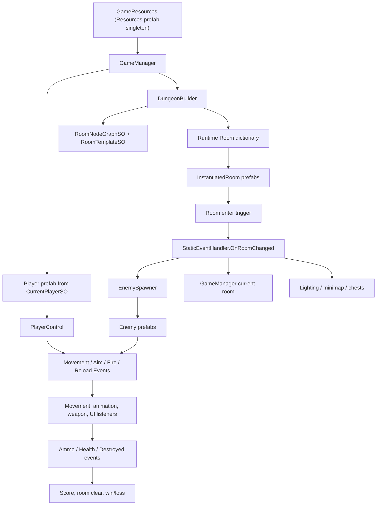
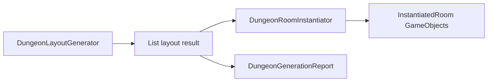

# Dungeon Gunner Course - Codebase Architecture and Refactoring Guide

Audience: Unity engineers who need to maintain, extend, or refactor the current project.

Scope: This document explains the current C# architecture, system responsibilities, object relationships, design patterns, ScriptableObject usage, event flow, important methods, and refactoring opportunities. It is written for developers, not players.

Last inspected: 2026-05-17.

## 1. Executive Summary

The project is a component-driven Unity 2D top-down shooter. It uses MonoBehaviours for runtime behavior, ScriptableObjects for authored data, static and instance events for decoupling, object pooling for transient VFX/audio/projectiles, and a custom procedural dungeon builder that connects room templates based on authored node graphs.

The strongest architectural ideas are:

| Strength | Evidence |
| --- | --- |
| Data-driven content | `PlayerDetailsSO`, `EnemyDetailsSO`, `WeaponDetailsSO`, `AmmoDetailsSO`, `DungeonLevelSO`, `RoomTemplateSO`, node graph assets. |
| Event-driven local actors | Player/enemy movement, aim, fire, reload, health, destroyed, and UI updates use event components. |
| Runtime model separated from authored template data | `RoomTemplateSO` is copied into runtime `Room`; `WeaponDetailsSO` is wrapped by runtime `Weapon`. |
| Pooling for short-lived objects | `PoolManager` reuses ammo, sound, and particle components. |
| Procedural layout from authored constraints | Room node graphs define intended structure while room templates provide concrete room geometry. |

Main engineering risks:

| Risk | Impact |
| --- | --- |
| God objects (`GameManager`, `DungeonBuilder`, `InstantiatedRoom`) | Harder testing, high change risk, many responsibilities per class. |
| Static global event bus | Easy to use, but hard to trace ownership/lifetime and can leak cross-scene state. |
| Direct singleton access everywhere | Tight coupling to runtime scene setup and hard-to-test logic. |
| String-based pool component lookup | `Type.GetType(componentType)` is fragile and fails silently if class names/namespaces change. |
| Heavy reliance on public mutable fields | Data can be changed from many places; invariants are hard to protect. |
| Direct `Input` and `UnityEngine.Random` usage | Harder to test, replay, seed, or support alternate input devices. |

## 2. Repository Layout

| Path | Purpose |
| --- | --- |
| `Assets/Scripts/AStar` | Grid node model and A* pathfinding for enemies. |
| `Assets/Scripts/Chests` | Chest spawning, chest state, and loot pickups. |
| `Assets/Scripts/Dungeon` | Runtime room model, room templates, procedural generation, doors, lighting. |
| `Assets/Scripts/DungeonMap` | Dungeon overview map control. |
| `Assets/Scripts/Effects` | Materialization effect coroutine. |
| `Assets/Scripts/Enemies` | Enemy runtime, spawning, movement AI, weapon AI, animation. |
| `Assets/Scripts/Enums` | Global enums. |
| `Assets/Scripts/Environment` | Useable, movable, destroyable, and light behavior. |
| `Assets/Scripts/GameManager` | Game state, resources access, room activation. |
| `Assets/Scripts/Health` | Health, damage, contact damage, destruction events/UI. |
| `Assets/Scripts/Minimap` | Minimap player icon behavior. |
| `Assets/Scripts/Misc` | Settings constants, singleton base, cursor, Cinemachine target. |
| `Assets/Scripts/Movement` | Movement event components and movement appliers. |
| `Assets/Scripts/NodeGraph` | ScriptableObject room graph plus custom editor. |
| `Assets/Scripts/Player` | Player runtime, control, animation, current player data. |
| `Assets/Scripts/PoolManager` | Object pooling. |
| `Assets/Scripts/Sounds` | Music and sound effect data/managers. |
| `Assets/Scripts/StaticEvents` | Global event bus. |
| `Assets/Scripts/UI` | Menus, high scores, player selection, health, weapon status, score. |
| `Assets/Scripts/Utilities` | Validation helpers, geometry helpers, weighted spawn helpers. |
| `Assets/Scripts/Weapons` | Weapon events, active weapon, fire/reload, ammo, effects. |

## 3. Runtime Architecture

### Lifetime Order

1. `GameResources.Instance` lazily loads a prefab from `Resources/GameResources`.
2. `GameManager.Awake` reads `GameResources.Instance.currentPlayer.playerDetails`.
3. `GameManager` instantiates the selected player prefab and calls `Player.Initialize`.
4. `GameManager.Start` sets score/multiplier and enters `gameStarted`.
5. `GameManager.Update` sees `gameStarted`, calls `PlayDungeonLevel`.
6. `DungeonBuilder.GenerateDungeon` builds and instantiates rooms.
7. `GameManager` moves player to the entrance room spawn position.
8. `RoomChanged` events activate downstream systems.

## 4. Core Design Patterns

| Pattern | Where Used | Benefit | Risk |
| --- | --- | --- | --- |
| Singleton MonoBehaviour | `GameManager`, `DungeonBuilder`, `PoolManager`, `EnemySpawner`, `MusicManager`, `SoundEffectManager`, `HighScoreManager`, `DungeonMap` | Easy global access. | Hidden dependencies, scene order sensitivity, hard testing. |
| Service Locator / Resources singleton | `GameResources.Instance` | Central asset references without scene injection. | Runtime Resources dependency and global mutable data. |
| Observer / Event Aggregator | `StaticEventHandler`, actor event components | Decouples producers from listeners. | Harder traceability and possible stale subscriptions. |
| Data Transfer Object | Event args, `Weapon`, `Room` | Runtime state separated from Unity objects. | Public mutable fields reduce invariants. |
| ScriptableObject data model | Details SOs and dungeon graph assets | Designer-friendly authoring. | Runtime mutation of SO references can leak between scenes if not isolated. |
| Object Pool | `PoolManager` | Avoids frequent instantiate/destroy for projectiles/VFX/sounds. | String-based component type and fixed pool sizes are fragile. |
| Custom editor graph | `RoomNodeGraphEditor`, `RoomNodeSO` | Designers author level topology visually. | Editor and data concerns are partially mixed. |
| Interface polymorphism | `IFireable`, `IUseable` | Ammo patterns and interactables share simple contracts. | Interfaces are narrow but good extension points. |

## 5. Data Model Overview

### ScriptableObjects

| Asset Type | Runtime Consumer | Main Data |
| --- | --- | --- |
| `CurrentPlayerSO` | `GameManager`, UI | Selected `PlayerDetailsSO` and player name. |
| `PlayerDetailsSO` | `Player`, `CharacterSelectorUI`, `GameManager` | Prefab, health, immunity, animator, weapons, minimap icon. |
| `MovementDetailsSO` | `PlayerControl`, `EnemyMovementAI` | Move speed range, roll speed, roll distance, cooldown. |
| `WeaponDetailsSO` | `Weapon`, `FireWeapon`, `ActiveWeapon`, UI | Sprite, ammo, sounds, shoot effect, clip/ammo/reload/fire tuning. |
| `AmmoDetailsSO` | `Ammo`, `AmmoPattern`, `FireWeapon` | Projectile sprite, prefab array, damage, speed, range, spread, trails. |
| `EnemyDetailsSO` | `Enemy`, `EnemySpawner`, `EnemyMovementAI`, `EnemyWeaponAI` | Prefab, chase distance, materialize, weapon, firing, health by level. |
| `DungeonLevelSO` | `GameManager`, `DungeonBuilder` | Level name, room template list, room node graph list. |
| `RoomTemplateSO` | `DungeonBuilder`, `InstantiatedRoom` | Prefab, music, room type, bounds, doorways, spawn points, enemy tables. |
| `RoomNodeGraphSO` | `DungeonBuilder`, editor | Graph nodes and parent/child room node IDs. |
| `RoomNodeTypeSO` | Dungeon generation and validation | Flags for entrance, corridor, boss, chest, none, etc. |
| `RoomNodeTypeListSO` | Graph editor and generator | Canonical room type list used instead of enum. |
| `SoundEffectSO` | `SoundEffectManager`, various gameplay scripts | Sound prefab, clip, duration, volume. |
| `MusicTrackSO` | `MusicManager`, room templates | Clip, volume, pitch, loop. |
| `WeaponShootEffectSO` | `WeaponShootEffect` | Particle emission, color, size, speed, lifetime, velocity. |
| `AmmoHitEffectSO` | `AmmoHitEffect` | Particle hit effect settings. |

### Runtime Data Classes

| Runtime Type | Purpose |
| --- | --- |
| `Room` | Mutable runtime room instance copied from graph and template. Tracks bounds, doors, cleared state, instantiated room, enemy data. |
| `Weapon` | Mutable runtime weapon state: clip ammo, reserve ammo, reload timer, list position, reload flag. |
| `Node` | A* node state: grid position, g/h/f cost, parent pointer. |
| `GridNodes` | 2D array wrapper for `Node`. |
| `SpawnableObjectRatio<T>` | Weighted content entry. |
| `SpawnableObjectsByLevel<T>` | Level-specific weighted content table. |
| `RandomSpawnableObject<T>` | Weighted random selector for spawn tables. |
| `RoomEnemySpawnParameters` | Per-level enemy count, spawn interval, concurrent enemy settings. |
| `EnemyHealthDetails` | Per-level enemy health and points. |
| `Score`, `HighScores` | High score data serialization model. |

## 6. Event Architecture

### Global Static Events

`StaticEventHandler` exposes project-wide events:

| Event | Raised By | Listened By | Purpose |
| --- | --- | --- | --- |
| `OnRoomChanged` | `InstantiatedRoom`, `DungeonMap`, `GameManager.PlayDungeonLevel` | `GameManager`, `EnemySpawner`, `ChestSpawner`, `RoomLightingControl`, `AStarTest` | Current room changed. |
| `OnRoomEnemiesDefeated` | `EnemySpawner` | `GameManager`, `ChestSpawner` | Room combat finished. |
| `OnPointsScored` | `EnemySpawner` | `GameManager` | Add enemy score. |
| `OnScoreChanged` | `GameManager` | `ScoreUI` | Refresh score UI. |
| `OnMultiplier` | `Ammo` | `GameManager` | Increase/decrease score multiplier. |

### Actor-Local Events

Actor-local events are MonoBehaviour components attached to player/enemy prefabs.

| Event Component | Args | Producer | Consumers |
| --- | --- | --- | --- |
| `MovementByVelocityEvent` | direction, speed | `PlayerControl` | `MovementByVelocity`, `AnimatePlayer` |
| `MovementToPositionEvent` | target, source, speed, direction, roll flag | `PlayerControl`, `EnemyMovementAI` | `MovementToPosition`, animations |
| `IdleEvent` | none | player/enemy control logic | `Idle`, animation scripts |
| `AimWeaponEvent` | aim direction, aim angle, weapon angle, direction vector | player/enemy weapon control | `AimWeapon`, animation scripts |
| `FireWeaponEvent` | fire flags, aim data | `PlayerControl`, `EnemyWeaponAI` | `FireWeapon` |
| `SetActiveWeaponEvent` | `Weapon` | player/enemy initialization, weapon switching | `ActiveWeapon`, `ReloadWeapon`, `WeaponStatusUI` |
| `ReloadWeaponEvent` | `Weapon`, ammo top-up percent | player input, empty clip, chest ammo | `ReloadWeapon`, UI |
| `WeaponFiredEvent` | `Weapon` | `FireWeapon` | UI |
| `WeaponReloadedEvent` | `Weapon` | `ReloadWeapon` | UI |
| `HealthEvent` | percentage, amount, damage | `Health` | `Player`, `Enemy`, UI, destroyable items |
| `DestroyedEvent` | player flag, points | `Player`, `Enemy`, destroyables | `Destroyed`, `GameManager`, `EnemySpawner` |

## 7. System-by-System Explanation

### Game Manager System

Files:

| File | Responsibility |
| --- | --- |
| `GameManager.cs` | High-level game state machine, player instantiation, dungeon progression, score, pause, win/loss. |
| `GameResources.cs` | Central asset reference singleton loaded from Resources. |
| `ActivateRooms.cs` | Activates/deactivates room and environment content around camera/player bounds. |

Important `GameManager` methods:

| Method | Explanation |
| --- | --- |
| `Awake` | Calls singleton base, gets selected player details, instantiates player. |
| `InstantiatePlayer` | Instantiates `playerDetails.playerPrefab`, gets `Player`, calls `Initialize`. |
| `OnEnable/OnDisable` | Subscribes/unsubscribes global events and player destroyed event. |
| `HandleGameState` | Central state switch; handles level start, pause, map, boss, win/loss/restart transitions. |
| `RoomEnemiesDefeated` | Scans all generated rooms, detects regular-room clear, boss-stage, level-complete, or game-won state. |
| `PlayDungeonLevel` | Calls dungeon generation, broadcasts initial room, positions player, displays level text. |
| `Fade` | CanvasGroup fade coroutine used for transitions and messages. |
| `GameWon/GameLost` | Disables player, evaluates high score rank, displays messages, sets restart state. |

Refactor pressure: `GameManager` mixes run orchestration, UI messaging, score, pause, high scores, player lifecycle, dungeon lifecycle, and transitions. Split into `RunStateController`, `ScoreService`, `TransitionPresenter`, and `PlayerSpawner` when expanding.

### Dungeon System

Files:

| File | Responsibility |
| --- | --- |
| `DungeonBuilder.cs` | Procedural graph/template layout and room instantiation. |
| `DungeonLevelSO.cs` | Level data: room templates and graphs. |
| `RoomTemplateSO.cs` | Authored room prefab data. |
| `Room.cs` | Runtime generated room data. |
| `Doorway.cs` | Doorway metadata for placement and tile copying. |
| `InstantiatedRoom.cs` | Runtime room prefab setup, doorway blocking, doors, A* arrays, trigger events. |
| `Door.cs` | Door open/lock/unlock behavior. |
| `DoorLightingControl.cs` | Door lighting behavior. |
| `RoomLightingControl.cs` | Room lighting response to room changes. |
| `RoomEnemySpawnParameters.cs` | Per-level spawn ranges. |

Key `DungeonBuilder` flow:

| Method | Explanation |
| --- | --- |
| `GenerateDungeon` | Sets current room templates, loads dictionary, attempts random graph builds, instantiates if successful. |
| `AttemptToBuildRandomDungeon` | Starts from entrance node and processes graph queue. |
| `ProcessRoomsInOpenRoomNodeQueue` | Breadth-first room node placement; entrance is positioned immediately. |
| `CanPlaceRoomWithNoOverlaps` | Selects parent doorway, chooses compatible template, tries placement until success/failure. |
| `PlaceTheRoom` | Computes room bounds by aligning opposite doorway with parent doorway. |
| `CheckForRoomOverlap` | Rejects rooms whose generated bounds overlap already positioned rooms. |
| `CreateRoomFromRoomTemplate` | Copies ScriptableObject/template data into mutable runtime `Room`. |
| `InstantiateRoomGameobjects` | Instantiates room prefabs, initializes `InstantiatedRoom`, stores reference. |
| `ClearDungeon` | Destroys previous generated rooms and clears runtime dictionary. |

Key `InstantiatedRoom` flow:

| Method | Explanation |
| --- | --- |
| `Initialise` | Populates tilemaps, blocks unused doorways, builds A* arrays, creates doors, hides collision tilemap. |
| `OnTriggerEnter2D` | Detects player entering room, marks visited, broadcasts room changed. |
| `BlockOffUnusedDoorWays` | Copies tiles over unconnected doorways on each tilemap layer. |
| `AddObstaclesAndPreferredPaths` | Converts collision tilemap into A* movement penalty array. |
| `AddDoorsToRooms` | Instantiates door prefabs for connected non-corridor doorways. |
| `LockDoors/UnlockDoors` | Controls door state and room trigger collider. |
| `UpdateMoveableObstacles` | Updates dynamic A* obstacle array from movable items. |

### Node Graph System

Files:

| File | Responsibility |
| --- | --- |
| `RoomNodeGraphSO.cs` | Stores graph nodes and ID dictionary. |
| `RoomNodeSO.cs` | Stores node rect, type, parent/child IDs, editor interactions, connection validation. |
| `RoomNodeTypeSO.cs` | Room type flags and editor color/name. |
| `RoomNodeTypeListSO.cs` | Canonical list of room node types. |
| `Editor/RoomNodeGraphEditor.cs` | Custom editor window for drawing and editing room graphs. |

Important design choice: room node types are ScriptableObjects instead of an enum. This lets designers add new room categories as data, but requires consistent `RoomNodeTypeListSO` configuration.

### Player System

Files:

| File | Responsibility |
| --- | --- |
| `Player.cs` | Required component stack, component cache, initialization, health death, weapon list. |
| `PlayerControl.cs` | Input, movement intent, roll, aim, fire, weapon switching, reload, use-item. |
| `AnimatePlayer.cs` | Subscribes to movement/idle/aim events and sets animator parameters. |
| `PlayerDetailsSO.cs` | Character data. |
| `CurrentPlayerSO.cs` | Cross-scene selected character/name storage. |

Key `PlayerControl` methods:

| Method | Explanation |
| --- | --- |
| `Update` | Early-outs if disabled or rolling; processes movement, weapons, use, roll cooldown. |
| `MovementInput` | Reads axes and right-click, raises movement or roll events. |
| `PlayerRollRoutine` | Moves player toward target through `MovementToPositionEvent`, then starts cooldown. |
| `AimWeaponInput` | Computes mouse vectors and aim direction; raises `AimWeaponEvent`. |
| `FireWeaponInput` | Converts left mouse hold into `FireWeaponEvent`. |
| `SwitchWeaponInput` | Handles mouse wheel, number keys, and reorder key. |
| `ReloadWeaponInput` | Checks ammo/clip/reload state and raises reload event. |
| `UseItemInput` | Finds nearby `IUseable` components and calls `UseItem`. |

### Movement System

Files:

| File | Responsibility |
| --- | --- |
| `MovementByVelocityEvent.cs` | Event for velocity movement. |
| `MovementByVelocity.cs` | Applies Rigidbody2D velocity from event. |
| `MovementToPositionEvent.cs` | Event for moving toward target. |
| `MovementToPosition.cs` | Applies Rigidbody2D movement toward target. |
| `IdleEvent.cs` | Event for idle. |
| `Idle.cs` | Stops Rigidbody2D velocity. |
| `MovementDetailsSO.cs` | Movement and roll tuning. |

Pattern: control logic raises intent events; movement components apply physics. This is a good separation and should be preserved.

### Weapon and Ammo System

Files:

| File | Responsibility |
| --- | --- |
| `Weapon.cs` | Runtime weapon state object. |
| `WeaponDetailsSO.cs` | Authored weapon stats and references. |
| `ActiveWeapon.cs` | Sets visible weapon sprite, collider, shoot/effect transforms. |
| `AimWeapon.cs` | Rotates/flips weapon visual based on aim direction and angle. |
| `FireWeapon.cs` | Fire rate, precharge, ammo spawning, clip decrement, events, sound/VFX. |
| `ReloadWeapon.cs` | Reload coroutine and ammo top-up handling. |
| Weapon event files | Local event channels for fire, reload, active weapon, fired, reloaded, aim. |
| `Ammo.cs` | Projectile movement, hit detection, damage, hit effect, multiplier. |
| `AmmoPattern.cs` | Pattern projectile that owns several `Ammo` children and implements `IFireable`. |
| `AmmoDetailsSO.cs` | Authored projectile stats. |
| `AmmoHitEffectSO.cs`, `AmmoHitEffect.cs` | Hit particle configuration/runtime. |
| `WeaponShootEffectSO.cs`, `WeaponShootEffect.cs` | Firing particle configuration/runtime. |
| `IFireable.cs` | Shared initialization contract for normal ammo and patterns. |

Key `FireWeapon` methods:

| Method | Explanation |
| --- | --- |
| `WeaponFire` | Handles precharge and fires if event says fire and readiness checks pass. |
| `IsWeaponReadyToFire` | Checks reserve ammo, reload state, precharge/cooldown, clip, and triggers reload if empty. |
| `FireAmmoRoutine` | Randomizes ammo count, spawn interval, prefab, speed; initializes each `IFireable`. |
| `WeaponShootEffect` | Reuses and configures pooled muzzle effect. |
| `WeaponSoundEffect` | Plays firing sound through `SoundEffectManager`. |

### Enemy System

Files:

| File | Responsibility |
| --- | --- |
| `Enemy.cs` | Component cache, health death, initialization, materialize, health/weapon setup. |
| `EnemyDetailsSO.cs` | Authored enemy stats, weapon, materialize, health, firing. |
| `EnemyHealthDetails.cs` | Level-specific health and points. |
| `EnemySpawner.cs` | Room-change listener, room encounter spawning, room clear detection. |
| `EnemyMovementAI.cs` | Chase and A* movement. |
| `EnemyWeaponAI.cs` | Timed burst firing and line-of-sight checks. |
| `AnimateEnemy.cs` | Enemy animation. |
| `SpawnTest.cs` | Test spawner for development. |

Key `EnemySpawner` methods:

| Method | Explanation |
| --- | --- |
| `StaticEventHandler_OnRoomChanged` | Resets counters, skips corridors/entrance/cleared rooms, gets spawn parameters, locks doors, starts spawning. |
| `SpawnEnemiesRoutine` | Selects weighted enemies and spawn points until total spawn count reached. |
| `CreateEnemy` | Instantiates enemy, initializes it, subscribes to destroyed event. |
| `Enemy_OnDestroyed` | Scores points, decrements count, clears room, unlocks doors, changes music, broadcasts room clear. |

### A* Pathfinding System

Files:

| File | Responsibility |
| --- | --- |
| `AStar.cs` | Static A* implementation. |
| `Node.cs` | Comparable path node. |
| `GridNodes.cs` | Node grid. |
| `AStarTest.cs` | Debug path visualization. |

A* uses two obstacle/penalty arrays from `InstantiatedRoom`:

| Array | Meaning |
| --- | --- |
| `aStarMovementPenalty` | Static collision/preferred path data from room tilemaps. `0` is unwalkable. |
| `aStarItemObstacles` | Dynamic obstacles from movable items. `0` is blocked. |

Performance strategy: `EnemyMovementAI` spreads path rebuilds across frames using `Time.frameCount % Settings.targetFrameRateToSpreadPathfindingOver`.

### Health and Damage System

Files:

| File | Responsibility |
| --- | --- |
| `Health.cs` | Current health, damage, healing, immunity, health events. |
| `HealthEvent.cs` | Health changed event. |
| `DestroyedEvent.cs` | Destroyed event. |
| `Destroyed.cs` | Destroys or disables object after destroyed event. |
| `DealContactDamage.cs` | Deals contact damage on trigger. |
| `ReceiveContactDamage.cs` | Receives contact damage. |
| `HealthBar.cs` | Enemy health bar presentation. |

Important behavior:

| Behavior | Implementation |
| --- | --- |
| Player roll avoids damage | `Health.TakeDamage` checks `player.playerControl.isPlayerRolling`. |
| Post-hit immunity | `PostHitImmunityRoutine` flashes sprite and disables damage. |
| Death is decoupled | `Player` and `Enemy` listen to `HealthEvent` and raise `DestroyedEvent`. |

### Chest and Interactable System

Files:

| File | Responsibility |
| --- | --- |
| `IUseable.cs` | `UseItem()` contract. |
| `ChestSpawner.cs` | Room entry/enemy defeated chest spawn and loot roll. |
| `Chest.cs` | Chest state machine, item materialization, pickups. |
| `ChestItem.cs` | Visual item text/icon materialization. |
| `Table.cs` | Useable table flipping. |

### Environment System

Files:

| File | Responsibility |
| --- | --- |
| `Environment.cs` | Room environment registration/validation. |
| `MoveItem.cs` | Updates movable obstacle array and confines item to room bounds. |
| `DestroyableItem.cs` | Health-driven destruction animation and sound. |
| `LightFlicker.cs` | Randomizes 2D light intensity. |
| `Table.cs` | Physics-based table interaction. |

### UI, Menu, and Persistence

Files:

| File | Responsibility |
| --- | --- |
| `MainMenuUI.cs` | Scene loading for play, high scores, character selector, instructions, quit. |
| `CharacterSelectorUI.cs` | Character carousel and selected player data. |
| `PlayerSelectionUI.cs` | UI row/card for a player option. |
| `PauseMenuUI.cs` | Volume controls and main menu return. |
| `WeaponStatusUI.cs` | Active weapon, ammo icons, reload bar/text. |
| `HealthUI.cs` | Player heart UI. |
| `ScoreUI.cs` | Score and multiplier text. |
| `HighScoreManager.cs` | Load/save/rank high scores. |
| `HighScores.cs`, `Score.cs`, `ScorePrefab.cs`, `DisplayHighScoresUI.cs` | High score data and display. |

### Sound System

Files:

| File | Responsibility |
| --- | --- |
| `MusicManager.cs` | Music fade, volume snapshots, track playback. |
| `MusicTrackSO.cs` | Music clip data. |
| `SoundEffectManager.cs` | Pooled one-shot sound playback and volume snapshots. |
| `SoundEffectSO.cs` | Sound clip data. |
| `SoundEffect.cs` | AudioSource wrapper for a sound instance. |

## 8. OOP, SOLID, and Code Quality Notes

### Encapsulation

The project favors public fields for runtime and ScriptableObject data. This is idiomatic for Unity serialization but weak for runtime invariants. Examples:

| Type | Issue |
| --- | --- |
| `Room` | Many public mutable fields can be changed by any system. |
| `Weapon` | Ammo, reload, and list position are public mutable fields. |
| ScriptableObjects | Public fields are designer-friendly but may be mutated accidentally at runtime. |

Recommendation: keep public fields on SOs where needed for inspector workflows, but use properties or methods for runtime state objects that enforce valid transitions.

### Single Responsibility Principle

Good examples:

| Class | Why |
| --- | --- |
| `MovementByVelocity` | Only applies velocity from movement event. |
| `Idle` | Only stops movement. |
| `HealthEvent`, `DestroyedEvent` | Narrow event dispatchers. |
| `RandomSpawnableObject<T>` | Weighted random selection only. |

High-pressure examples:

| Class | Mixed Responsibilities |
| --- | --- |
| `GameManager` | State machine, score, player spawn, dungeon level load, UI message transitions, high score save. |
| `DungeonBuilder` | Graph traversal, template selection, room placement, overlap logic, room instantiation, cleanup. |
| `InstantiatedRoom` | Tilemap lookup, doorway blocking, A* setup, door placement, trigger events, dynamic obstacles. |
| `PlayerControl` | Input, movement command, roll, weapon switching, reload, use interactable. |

### Open/Closed Principle

Good extension points:

| Extension | Current Support |
| --- | --- |
| New ammo behaviors | Implement `IFireable`. |
| New interactables | Implement `IUseable`. |
| New room types | Add `RoomNodeTypeSO` and include in list. |
| New content | Create ScriptableObjects and prefabs. |

Weak extension points:

| Area | Reason |
| --- | --- |
| Game states | `GameManager.HandleGameState` switch grows with new states. |
| Input | Hardcoded `Input` API prevents alternate devices/remapping without edits. |
| Dungeon placement | Corridor orientation logic is coded specifically for NS/EW. |
| Pooling | New pooled prefab requires component type string in inspector. |

### Dependency Inversion

Most gameplay code depends directly on concrete singletons:

| Example | Coupling |
| --- | --- |
| `EnemyMovementAI` | Directly calls `GameManager.Instance.GetPlayer()` and current room. |
| `FireWeapon` | Directly calls `PoolManager.Instance` and `SoundEffectManager.Instance`. |
| `GameManager` | Directly calls `DungeonBuilder.Instance`, `DungeonMap.Instance`, `HighScoreManager.Instance`. |

Recommendation: introduce small service interfaces only around systems that need tests or platform variation first: input, random, pool, score, dungeon generation.

## 9. Method-Level Reading Guide

This section gives a line-level style guide to how the main code should be read. It maps scripts to the fields, methods, and coupling that matter most.

| Script | Read It As |
| --- | --- |
| `GameManager.cs` | State machine owner. Fields are references/state; `Awake` wires player; event handlers update current room/score; `HandleGameState` is the runtime loop; coroutines are UI transition states. |
| `GameResources.cs` | Global asset registry. Every public field is an injected reference used somewhere else. Validation checks missing setup. |
| `DungeonBuilder.cs` | Procedural compiler. It converts abstract graph nodes into positioned `Room` runtime records, then instantiates prefabs. |
| `InstantiatedRoom.cs` | Runtime room initializer. Every tilemap and doorway method prepares the room prefab after placement. |
| `Room.cs` | Runtime room DTO. Getter methods look up level-specific spawn counts and parameters. |
| `RoomTemplateSO.cs` | Designer room schema. Bounds/doorways/spawns must match prefab tilemap coordinates. |
| `Player.cs` | Composition root for player prefab. Required components describe everything the player actor needs. |
| `PlayerControl.cs` | Input adapter. It should not directly animate or move; it raises events for other components. |
| `Enemy.cs` | Composition root for enemy prefab. Initialization transfers SO data into runtime components. |
| `EnemySpawner.cs` | Encounter controller. It owns room enemy counts and room clear transition. |
| `EnemyMovementAI.cs` | A* chase brain. It decides when to rebuild path and emits movement-to-position events. |
| `EnemyWeaponAI.cs` | Ranged attack brain. It handles timed burst firing and line-of-sight. |
| `FireWeapon.cs` | Weapon firing state machine. Read readiness checks before ammo spawn logic. |
| `ReloadWeapon.cs` | Reload state machine. It owns reload coroutine and top-up logic. |
| `Ammo.cs` | Projectile runtime. `InitialiseAmmo` resets all state; `Update` moves; trigger handles damage/effects/multiplier. |
| `Health.cs` | Damage gate. `TakeDamage` applies roll immunity, damage, health events, and post-hit immunity. |
| `StaticEventHandler.cs` | Global event bus. Each `Call...` method is a single publish point. |
| `PoolManager.cs` | Fixed queue pool. Pool key is prefab instance ID; queue cycles components. |
| `HelperUtilities.cs` | Mixed utility class. Includes aim math, validation, camera mouse position, nearest spawn. |

## 10. Refactoring Opportunities

### Priority 1: Safer Pool Manager

Problem: `PoolManager.Pool.componentType` is a string, then `Type.GetType(componentType)` is used. This can fail if namespaces are added, class names change, assemblies differ, or strings are mistyped.

Recommended refactor:

| Step | Change |
| --- | --- |
| 1 | Replace `componentType` string with a serialized `MonoBehaviour` component reference or enum-backed known pool type. |
| 2 | Validate prefab contains the expected component in `OnValidate`. |
| 3 | Log a hard error if pool component is null during pool creation. |
| 4 | Optionally auto-expand pool when all instances are active. |

### Priority 2: Split GameManager

Problem: `GameManager` controls too much.

Suggested split:

| New Type | Responsibility |
| --- | --- |
| `RunStateController` | Own game state transitions. |
| `PlayerSpawner` | Instantiate and initialize player. |
| `DungeonRunController` | Generate levels, move player to entrance, handle level complete. |
| `ScoreService` | Score/multiplier/high-score submission. |
| `ScreenMessagePresenter` | Fade and text message coroutines. |

Migration approach: extract without changing behavior. Start by moving score fields and event handlers into `ScoreService`, because it has clear inputs/outputs.

### Priority 3: Separate Dungeon Generation From Instantiation

Problem: `DungeonBuilder` both calculates room layout and instantiates Unity prefabs.

Recommended design:

Benefits:

| Benefit | Why It Matters |
| --- | --- |
| Testable layout | Room overlap and doorway logic can be unit tested without scene objects. |
| Better designer errors | Failed generation can report exact incompatible graph/template constraints. |
| Seed support | Generator can use injected RNG. |

### Priority 4: Replace Static Event Bus With Scoped Channels

Problem: `StaticEventHandler` is convenient but global. Static events can preserve subscriptions across scene reloads if cleanup fails.

Refactor options:

| Option | Pros | Cons |
| --- | --- | --- |
| ScriptableObject event channels | Designer visible, decoupled, scene-safe if assigned. | More assets to manage. |
| Runtime event aggregator service | Easier test injection. | More setup code. |
| Keep static but add reset | Minimal change. | Still globally coupled. |

Recommended first step: add `StaticEventHandler.ClearAllListenersForSceneReload()` or call a reset hook on scene load, then migrate high-risk events later.

### Priority 5: Input Abstraction

Problem: `PlayerControl` directly calls `Input.GetAxisRaw`, `Input.GetMouseButton`, `Input.GetKeyDown`, and mouse scroll. This makes remapping, gamepad support, and testing harder.

Recommended refactor:

| Interface | Methods |
| --- | --- |
| `IPlayerInput` | `Move`, `AimWorldPosition`, `FireHeld`, `RollPressed`, `ReloadPressed`, `UsePressed`, `NextWeapon`, `PreviousWeapon`, `WeaponSlotPressed`. |

Use Unity's new Input System later if desired, but an adapter interface can be introduced first without changing gameplay.

### Priority 6: Runtime State Wrappers

Problem: `Weapon` and `Room` are public mutable DTOs.

Recommended changes:

| Type | Improvement |
| --- | --- |
| `Weapon` | Add methods `CanReload`, `BeginReload`, `FinishReload`, `ConsumeShot`, `TopUpAmmo`. |
| `Room` | Add methods `MarkVisited`, `MarkCleared`, `CanSpawnEnemies`, `IsCombatRoom`. |

This protects invariants and reduces duplicated checks across systems.

### Priority 7: Validation Tooling

Current `OnValidate` checks are useful but distributed. Add editor tooling that scans all dungeon levels and reports:

| Validation | Failure Prevented |
| --- | --- |
| Every graph node type has at least one matching room template. | Generation failure. |
| Room templates have compatible opposite doorways for connected graph patterns. | Retry storms. |
| Spawn positions are inside room bounds and not collision blocked. | Enemies/chests spawning badly. |
| Required pooled prefabs are in `PoolManager`. | Runtime null/projectile failures. |
| Enemy health details exist for every dungeon level. | Default/incorrect health. |
| Chest reward tables exist for each target level. | Empty or invalid loot. |

### Priority 8: Namespaces and Assembly Definitions

Problem: all scripts are in the global namespace and default assembly. This increases name collision risk and slows compilation.

Suggested namespaces:

| Namespace | Scripts |
| --- | --- |
| `DungeonGunner.Core` | Settings, singleton, resources, static events. |
| `DungeonGunner.Dungeon` | Dungeon, node graph, room, doors. |
| `DungeonGunner.Actors.Player` | Player scripts. |
| `DungeonGunner.Actors.Enemies` | Enemy scripts. |
| `DungeonGunner.Combat` | Weapons, ammo, health, damage. |
| `DungeonGunner.UI` | UI scripts. |
| `DungeonGunner.Audio` | Music and sounds. |

Add asmdefs after namespaces are stable. Keep editor code in separate editor assembly.

## 11. Bugs and Edge Cases To Check

| Area | Potential Issue | Suggested Fix |
| --- | --- | --- |
| `GameManager.OnDisable` | Assumes `player` is not null when unsubscribing destroyed event. | Null-check player/destroyedEvent. |
| `Health.Start` | Calls health event before `SetStartingHealth` if initialization order changes. | Ensure all actors set starting health before `Health.Start`, or initialize in `Awake`/explicit method. |
| `PlayerControl.ReloadWeaponInput` | Comment says "less than clip capacity then return"; condition checks remaining reserve ammo and infinite ammo. | Review logic and rename variables/comments for clarity. |
| `AStar.GetValidNodeNeighbour` | Bounds use `>= upper-lower` while arrays are allocated `upper-lower+1`; last row/column may be unreachable. | Confirm intended grid dimensions and adjust bounds if off-by-one. |
| `EnemyMovementAI.GetNearestNonObstaclePlayerPosition` | Empty catch suppresses out-of-bounds and other errors. | Catch `IndexOutOfRangeException` only or add explicit bounds checks. |
| `PoolManager` | Reuses active pooled object by disabling it if exhausted. | Add optional expansion or warning to avoid disappearing projectiles/VFX. |
| `StaticEventHandler` | Static events can keep stale listeners if unsubscribe misses. | Reset static listeners on scene unload/domain reload. |
| `Chest.UseItem` | Multiple colliders in interact radius can use multiple items in one press. | Select nearest `IUseable` or stop after first successful use. |
| `Ammo.OnTriggerEnter2D` | Hit effect runs on any trigger, even if no damage target. | Confirm collision layers prevent harmless triggers; otherwise filter. |
| `RoomTemplateSO` | Uses `UnityEditor` namespace in runtime script. | Wrap editor-only code and using in `#if UNITY_EDITOR` to avoid build issues. |

## 12. Testing Strategy

Current project appears oriented around manual Unity testing. Recommended coverage:

| Test Type | Target |
| --- | --- |
| EditMode unit tests | `RandomSpawnableObject<T>`, `AStar`, room overlap, doorway matching, score multiplier clamp. |
| EditMode asset validation tests | All ScriptableObjects required fields, every dungeon level can find templates for graph node types. |
| PlayMode smoke tests | Main scene starts, player instantiates, first dungeon builds, room entry spawns enemies. |
| PlayMode combat tests | Weapon fire consumes ammo, reload refills clip, enemy destroyed scores points, room unlocks after clear. |
| Performance tests | Many enemies pathing in one room, projectile-heavy weapons, generation retries. |

## 13. Coding Standards To Adopt

| Standard | Reason |
| --- | --- |
| Put runtime scripts in namespaces. | Prevent class collisions and support asmdefs. |
| Prefer private serialized fields plus public read-only properties. | Keep inspector support while protecting runtime state. |
| Avoid static mutable events for scene-local gameplay. | Reduce lifetime bugs. |
| Avoid direct singleton calls in low-level logic. | Improve tests and reuse. |
| Replace magic strings/tags where possible with constants or serialized LayerMasks. | Safer refactors. |
| Use explicit exception handling. | Prevent silent bugs. |
| Add XML summary only for public APIs and non-obvious behavior. | Keep docs useful without noise. |
| Keep editor-only APIs behind `#if UNITY_EDITOR`. | Avoid player build problems. |

## 14. Practical Extension Recipes

### Create a New Projectile Pattern

1. Create prefab with a component implementing `IFireable`.
2. If it owns child ammo objects, follow `AmmoPattern` and call child `Ammo.InitialiseAmmo(..., overrideAmmoMovement: true)`.
3. Add prefab to `AmmoDetailsSO.ammoPrefabArray`.
4. Register prefab in `PoolManager` with the correct component type.
5. Test with a weapon using that ammo.

### Add a New Room Type

1. Create `RoomNodeTypeSO`.
2. Add it to `RoomNodeTypeListSO`.
3. Update graph authoring if parent/child validation should treat it specially.
4. Create one or more `RoomTemplateSO` assets using the new type.
5. Add templates to relevant `DungeonLevelSO`.

### Add a New Room Template

1. Create room prefab with expected tilemaps and tags: ground, decoration, front, collision, minimap.
2. Add `InstantiatedRoom` and room trigger collider setup.
3. Create `RoomTemplateSO`.
4. Set bounds from local tilemap coordinates.
5. Define up to four `Doorway` entries with orientation and tile-copy settings.
6. Add spawn positions.
7. Add enemy spawn tables and parameters if it is a combat room.
8. Add the template to relevant dungeon levels.

## 15. Recommended First Refactor Sequence

1. Add build-safe guard around `RoomTemplateSO` editor-only using/code.
2. Replace `PoolManager` string component lookup with serialized component reference or validated prefab component.
3. Add null guards in manager unsubscribe paths.
4. Add dungeon asset validation editor window.
5. Extract score logic from `GameManager` into a `ScoreService`.
6. Extract dungeon layout generation from room prefab instantiation.
7. Introduce `IPlayerInput` and seedable `IRandomSource`.
8. Add namespaces and asmdefs after tests are green.

This order reduces runtime failure risk first, then improves scalability without rewriting the game loop all at once.

