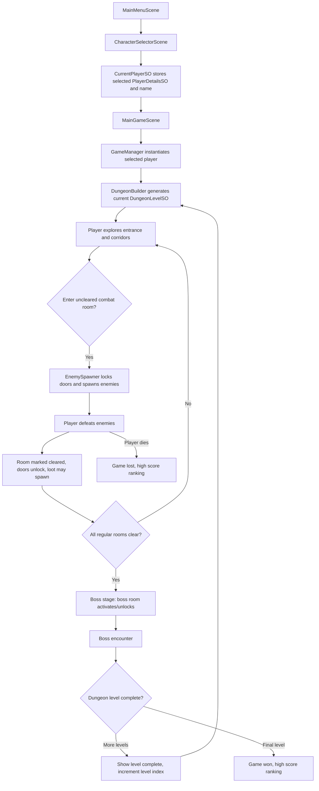
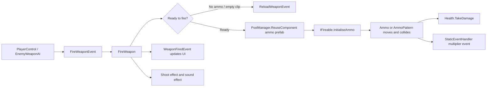
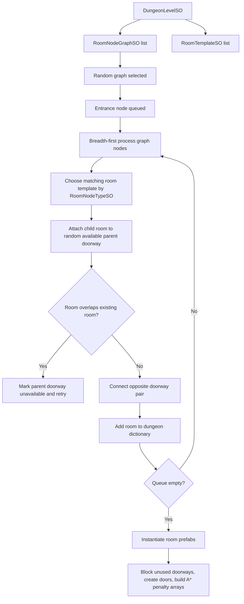

# Dungeon Gunner Course - Game Design Document

Audience: Unity gameplay programmers, technical designers, level designers, and content implementers.

Scope: This document describes the current playable design and implementation-facing design rules for the 2D top-down procedural shooter in this repository. It is not a marketing pitch or player-facing manual.

Last inspected: 2026-05-17.

## 1. High Concept

Dungeon Gunner Course is a 2D top-down dungeon shooter where the player selects a character, enters procedurally assembled dungeon levels, clears rooms of enemies, collects chest rewards, defeats boss encounters, and progresses through a configured sequence of dungeon levels.

The game is built around authored room content plus procedural assembly. Designers author room templates, room node graphs, enemy pools, chest reward tables, weapons, ammo, music, and character data as ScriptableObjects and prefabs. At runtime, the game chooses a room graph, places compatible room templates without overlap, connects matching doorways, and activates combat encounters as the player enters rooms.

## 2. Core Pillars

| Pillar | Current Implementation | Design Intent |
| --- | --- | --- |
| Procedural dungeon runs | `DungeonBuilder` selects a `RoomNodeGraphSO`, places `RoomTemplateSO` prefabs, and retries failed layouts. | Runs feel structured but variable; graph controls pacing, room templates create variety. |
| Room-gated combat | `EnemySpawner` locks doors, spawns enemies, and unlocks after all enemies die. | Each combat room is a discrete encounter with clear completion feedback. |
| Responsive twin-stick style shooting | Keyboard movement plus mouse aim/fire through player weapon event components. | Player should kite, dodge, aim precisely, and manage reload timing. |
| Data-driven content | Characters, movement, weapons, ammo, enemies, levels, rooms, sounds, and effects use ScriptableObjects. | New content should usually be created by configuring data, not by changing code. |
| Score pressure | Hits and misses affect the score multiplier through ammo collision results. | Accuracy and survival are rewarded beyond raw completion. |
| Readable dungeon navigation | Minimap, room lighting, doors, and dungeon overview map communicate explored space. | Players should understand where they are and where progression remains. |

## 3. Target Experience

The player starts from the main menu, chooses a character, and enters `MainGameScene`. The run is a sequence of configured `DungeonLevelSO` assets. Each level generates from a level-specific room graph pool and room template pool. The player begins in an entrance room, travels through corridors and combat rooms, finds loot, then reaches boss-stage rules after regular rooms are cleared.

Combat is fast but readable:

| Input | Action |
| --- | --- |
| WASD / Horizontal and Vertical axes | Move. |
| Mouse movement | Aim character and active weapon. |
| Left mouse | Fire active weapon. |
| Right mouse during movement | Roll toward movement direction if cooldown is ready. |
| Mouse wheel / number keys | Switch weapons. |
| R | Reload active weapon when reload is valid. |
| E | Use nearby interactable object such as chest or table. |
| Escape | Pause / resume. |
| Tab | Hold dungeon overview map while in allowed game states. |

## 4. Game Loop

## 5. Game States

The `GameState` enum defines the current mode:

| State | Meaning | Main Owner |
| --- | --- | --- |
| `gameStarted` | Initial game boot for a run. | `GameManager` |
| `playingLevel` | Player can explore normal rooms. | `GameManager`, `PlayerControl` |
| `engagingEnemies` | A regular combat room is active. | `EnemySpawner` |
| `bossStage` | Regular rooms are cleared and boss room is available. | `GameManager` |
| `engagingBoss` | Boss room combat is active. | `EnemySpawner` |
| `levelCompleted` | Current level cleared, transition to next level. | `GameManager` |
| `gameWon` | Final level completed. | `GameManager`, `HighScoreManager` |
| `gameLost` | Player destroyed. | `GameManager`, `Player` |
| `gamePaused` | Pause menu active and player disabled. | `GameManager`, `PauseMenuUI` |
| `dungeonOverviewMap` | Overview map display mode. | `DungeonMap` |
| `restartGame` | Return to main menu. | `GameManager` |

Design rule: new features that affect control, spawning, scoring, or level transitions should respect this state machine instead of introducing independent state flags.

## 6. Scenes

| Scene | Purpose |
| --- | --- |
| `MainMenuScene` | Entry menu, starts character selection, high scores, instructions, quit. |
| `CharacterSelectorScene` | Additive character carousel; writes selection to `CurrentPlayerSO`. |
| `MainGameScene` | Core gameplay scene. Contains managers, UI, map, camera, resources. |
| `HighScoreScene` | Displays persisted high score data. |
| `InstructionsScene` | Instruction overlay / additive menu scene. |

## 7. Player Characters

Characters are configured through `PlayerDetailsSO` assets:

| Character Data | Use |
| --- | --- |
| Character name | UI and fallback high score name. |
| Player prefab | Runtime object instantiated by `GameManager`. |
| Runtime animator controller | Visual behavior for selected character. |
| Starting health | Passed into `Health.SetStartingHealth`. |
| Hit immunity settings | Controls post-hit invulnerability flash. |
| Starting weapon and weapon list | Used by `Player` and `PlayerControl` to initialize inventory. |
| Minimap icon and hand sprite | Visual identity in UI/minimap/weapon presentation. |

Current assets include `TheThief`, `TheScientist`, and `TheGeneral`.

## 8. Player Mechanics

### Movement

`PlayerControl` reads Unity input axes each frame. Direction is normalized approximately for diagonal movement by multiplying by `0.7f`. Movement is not applied directly by `PlayerControl`; it raises `MovementByVelocityEvent`, then `MovementByVelocity` applies physics movement and `AnimatePlayer` updates animation.

### Roll

When the player is moving and right-clicks, `PlayerControl` starts a roll coroutine if `playerRollCooldownTimer <= 0`. Roll uses `MovementToPositionEvent` to move toward a target position based on `MovementDetailsSO.rollDistance` and `rollSpeed`.

Design constraints:

| Variable | Design Effect |
| --- | --- |
| `rollDistance` | Dodging distance and escape power. |
| `rollSpeed` | How quickly the roll resolves. |
| `rollCooldownTime` | Frequency of invulnerability/mobility option. |

Health ignores damage while `player.playerControl.isPlayerRolling` is true.

### Aim

Mouse world position is converted through `HelperUtilities.GetMouseWorldPosition`. The player-to-cursor angle controls body aim animation, while weapon-shoot-position-to-cursor angle controls projectile direction. Very close shots use player aim angle based on `Settings.useAimAngleDistance`.

### Interact

Pressing `E` performs `Physics2D.OverlapCircleAll` within 2 Unity units and calls `IUseable.UseItem()` on nearby usable components. Current useables include chests and tables.

## 9. Weapons and Ammo

Weapons are runtime `Weapon` data objects backed by `WeaponDetailsSO`. Ammo behavior is driven by `AmmoDetailsSO` and instantiated from object pools.

| Weapon Field | Balancing Meaning |
| --- | --- |
| `weaponCurrentAmmo` | Projectile type and hit behavior. |
| `weaponClipAmmoCapacity` | Shots per reload. |
| `weaponAmmoCapacity` | Reserve ammo ceiling. |
| `weaponFireRate` | Delay between shots. |
| `weaponPrechargeTime` | Charge-up before firing. |
| `weaponReloadTime` | Downtime on reload. |
| `hasInfiniteAmmo` | Reserve ammo never depletes. |
| `hasInfiniteClipCapacity` | Clip does not need reload. |

| Ammo Field | Balancing Meaning |
| --- | --- |
| `ammoDamage` | Health removed on hit. |
| `ammoSpeedMin/Max` | Projectile travel speed variance. |
| `ammoRange` | Lifetime/distance budget. |
| `ammoSpreadMin/Max` | Accuracy. |
| `ammoSpawnAmountMin/Max` | Multi-projectile shot count. |
| `ammoSpawnIntervalMin/Max` | Burst cadence within a shot. |
| `ammoChargeTime` | Delay before projectile movement begins. |
| `isPlayerAmmo` | Enables score multiplier behavior. |
| `isAmmoTrail` | Visual trail configuration. |

## 10. Enemy Design

Enemies are configured by `EnemyDetailsSO` and use a shared component architecture similar to the player:

| System | Responsibility |
| --- | --- |
| `Enemy` | Component cache, initialization, health death, materialize timing, starting weapon. |
| `EnemyMovementAI` | Chase trigger, A* path rebuild scheduling, movement event calls. |
| `EnemyWeaponAI` | Burst interval/duration timers, aim at player, optional line-of-sight gate. |
| `AnimateEnemy` | Movement, idle, and aim animation parameters. |
| `Health`, `DestroyedEvent`, `Destroyed` | Damage and destruction pipeline. |

Enemy tuning fields:

| Field | Design Use |
| --- | --- |
| `chaseDistance` | Distance before AI begins pathing. |
| `enemyWeapon` | Null for melee/contact enemies, weapon SO for ranged enemies. |
| `firingIntervalMin/Max` | Time between shooting bursts. |
| `firingDurationMin/Max` | Duration of each burst. |
| `firingLineOfSightRequired` | Whether obstacles block shooting decisions. |
| `enemyHealthDetailsArray` | Level-specific health and score value. |
| `enemyMaterializeTime` | Spawn readability delay. |

Current enemy content includes SlimeBlock colors, Hedusa colors, Slizzard, MudRock, Grimonk, Orc, SkullFace bosses, and SlimeBlockKing bosses.

## 11. Dungeon Generation

Dungeon generation combines authored topology and authored room templates.

### Authoring Model

| Asset | Role |
| --- | --- |
| `DungeonLevelSO` | One level in run sequence; points to room template pool and graph pool. |
| `RoomNodeGraphSO` | Abstract progression topology. Nodes are room roles, not prefabs. |
| `RoomNodeTypeSO` | Designer-defined room role: entrance, corridor, small, medium, large, chest, boss. |
| `RoomTemplateSO` | Concrete room prefab plus bounds, doorways, spawn positions, music, enemies. |
| `Doorway` | Direction, tile-copy area, door prefab, connected/unavailable flags. |
| `Room` | Runtime generated room instance data copied from template and graph node. |

### Placement Rules

| Rule | Implementation |
| --- | --- |
| Entrance is first | `AttemptToBuildRandomDungeon` finds node type with `isEntrance`. |
| Corridors follow parent direction | `GetRandomTemplateForRoomConsistentWithParent` picks NS/EW corridor templates based on parent doorway orientation. |
| Rooms attach through opposite doorways | `GetOppositeDoorway` matches north/south or east/west. |
| Bounds cannot overlap | `CheckForRoomOverlap` and interval overlap tests reject invalid placement. |
| Failed graph builds retry | Settings allow 1000 rebuild attempts per graph and 10 total graph attempts. |
| Unused doors are blocked | `InstantiatedRoom.BlockOffUnusedDoorWays` copies tiles over openings. |

## 12. Room Flow

When the player enters a room trigger:

1. `InstantiatedRoom.OnTriggerEnter2D` marks the room visited.
2. It calls `StaticEventHandler.CallRoomChangedEvent(room)`.
3. `GameManager` updates current room.
4. `EnemySpawner` evaluates whether enemies should spawn.
5. Room lighting, chest spawners, minimap, and optional A* test listeners react.

Combat rooms lock doors until enemies are cleared. Corridors and entrances do not trigger combat spawning.

## 13. Chests and Rewards

Chests are driven by `ChestSpawner` prefab variants. They can spawn on room entry or after enemies are defeated, and at either the spawner position or player position.

Reward roll:

| Reward | Behavior |
| --- | --- |
| Health | Calls `Player.health.AddHealth(percent)`. |
| Ammo | Calls `ReloadWeaponEvent` on the active weapon with a top-up percent. |
| Weapon | Adds weapon to player if not already owned; otherwise displays already owned message. |

Chest state advances through `closed`, `healthItem`, `ammoItem`, `weaponItem`, and `empty`. This means a chest may contain multiple reward categories, served one interaction at a time.

## 14. Scoring

Score is event-driven:

| Trigger | Event |
| --- | --- |
| Enemy destroyed | `StaticEventHandler.CallPointsScoredEvent(points)` |
| Player ammo hits enemy | `StaticEventHandler.CallMultiplierEvent(true)` |
| Player ammo misses or expires | `StaticEventHandler.CallMultiplierEvent(false)` |
| Score or multiplier changes | `StaticEventHandler.CallScoreChangedEvent(score, multiplier)` |

`GameManager` clamps multiplier between 1 and 30. High scores are evaluated on win or loss and persisted through `HighScoreManager`.

## 15. Navigation, Map, and Lighting

| System | Purpose |
| --- | --- |
| `DungeonMap` | Displays overview map and broadcasts room changes when map room selection occurs. |
| `Minimap` | Tracks player icon and rotation/position behavior. |
| `RoomLightingControl` | Reacts to room changes to dim/light rooms. |
| `DoorLightingControl` | Handles door lighting trigger behavior. |
| `ActivateRooms` | Activates nearby room/environment content around the player and minimap camera. |

## 16. Audio and VFX

Audio is data-driven through `MusicTrackSO` and `SoundEffectSO`.

| System | Behavior |
| --- | --- |
| `MusicManager` | Plays and fades between room ambient, battle, and menu tracks. |
| `SoundEffectManager` | Uses object pool to play one-shot sound prefabs. |
| `WeaponShootEffect` | Applies particle effect settings from `WeaponShootEffectSO`. |
| `AmmoHitEffect` | Applies particle hit settings from `AmmoHitEffectSO`. |
| `MaterializeEffect` | Used for enemy, chest, and chest item materialization. |
| `LightFlicker` | Adds randomized light intensity changes. |

## 17. Content Pipeline

### Add a New Player Character

1. Create or duplicate a player prefab with required `Player` component stack.
2. Create `PlayerDetailsSO`.
3. Assign prefab, animator controller, health, immunity, starting weapon, weapon list, minimap icon, and hand sprite.
4. Add the new `PlayerDetailsSO` to `GameResources.playerDetailsList`.
5. Verify `CharacterSelectorUI` displays it and `CurrentPlayerSO` receives it.

### Add a New Weapon

1. Create `AmmoDetailsSO` and optional hit effect.
2. Ensure ammo prefab contains `IFireable` implementation (`Ammo` or `AmmoPattern`) and is registered in `PoolManager`.
3. Create `WeaponDetailsSO`.
4. Assign sprite, shoot position, ammo, sound, effect, clip/ammo/reload/fire values.
5. Add weapon to player starting lists or chest spawn tables.

### Add a New Enemy

1. Create or duplicate enemy prefab with required `Enemy` stack.
2. Create movement details.
3. Create `EnemyDetailsSO`.
4. Assign prefab, chase distance, materialize settings, optional weapon, firing timings, health per level, score per level.
5. Add enemy to relevant `RoomTemplateSO.enemiesByLevelList` with weighted ratios.

### Add a New Dungeon Level

1. Create `DungeonLevelSO`.
2. Create room node graphs for desired pacing.
3. Create or assign room templates covering all graph node types.
4. Ensure each room template has valid bounds, doorway definitions, spawn positions, music, enemy tables, and spawn parameters.
5. Add the level to `GameManager.dungeonLevelList`.

## 18. Current Design Risks

| Risk | Impact | Recommendation |
| --- | --- | --- |
| Boss stage is unlocked only after regular rooms are cleared. | Strong progression clarity, but can make exploration feel mandatory. | Consider optional bonus rooms versus required clear rooms. |
| Chest rewards are percent based and highly random. | Good roguelite feel, but hard to balance without telemetry. | Track reward output per level and cap reward frequency. |
| Score multiplier reacts to each projectile collision or expiry. | Multi-shot weapons may swing multiplier sharply. | Tune multiplier contribution by shot event or weapon family if scoring feels noisy. |
| Enemy pathfinding is per-room and update-spread over frames. | Performance-friendly, but enemies in dense rooms may feel delayed. | Tune `targetFrameRateToSpreadPathfindingOver` and enemy concurrency by platform. |
| Dungeon generation can fail if room graph/template compatibility is poor. | Designers can accidentally create non-generating levels. | Add editor validation tooling for graph-template doorway compatibility. |

## 19. Further Implementation Roadmap

| Priority | Feature | Design Value | Engineering Notes |
| --- | --- | --- | --- |
| High | Editor validation dashboard for dungeon levels | Prevent invalid room graph/template sets. | Reuse `OnValidate` rules and add graph traversal checks. |
| High | Encounter difficulty budget | Better level progression. | Extend `RoomEnemySpawnParameters` with budget and enemy cost. |
| Medium | Item rarity tiers | Cleaner loot tuning. | Extend `SpawnableObjectRatio<T>` with rarity metadata or separate tables. |
| Medium | Boss-specific phase data | More distinct boss fights. | Add `BossDetailsSO` or behavior modules. |
| Medium | Run telemetry/debug overlay | Balance iteration. | Track generated room count, spawn counts, loot rolls, hit/miss ratio. |
| Low | Seeded dungeon generation | Reproducible testing and daily runs. | Replace direct `UnityEngine.Random` usage with seedable RNG service. |

